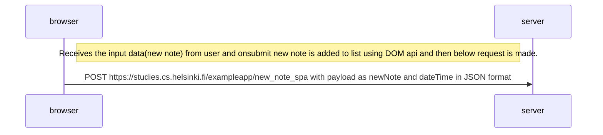

# Sequence Diagram for the New Note addition in SPA(Single page application)

```mermaid
sequenceDiagram
participant browser
participant server

    Note right of browser: Receives the input data(new note) from user and onsubmit new note is added to list using DOM api and then below request is made.
    browser->>server: POST https://studies.cs.helsinki.fi/exampleapp/new_note_spa with payload as newNote and dateTime in JSON format
```