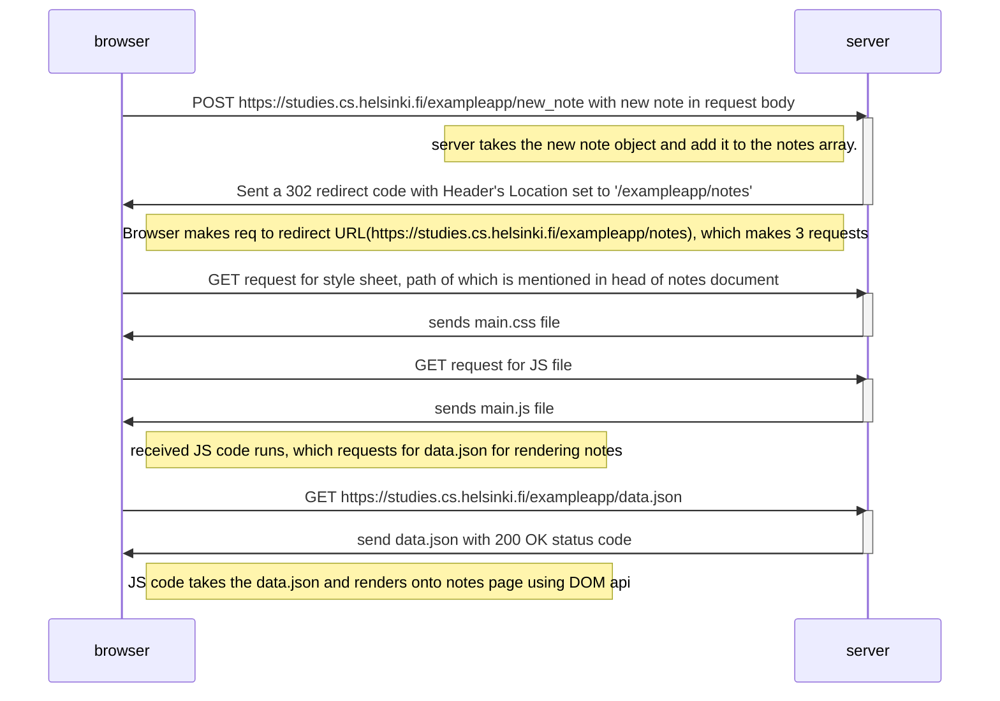

# Sequence Diagram for new note addtion

```mermaid
sequenceDiagram
    participant browser
    participant server

    browser->>server: POST https://studies.cs.helsinki.fi/exampleapp/new_note with new note in request body

    activate server
    Note left of server: server takes the new note object and add it to the notes array.
    server->>browser: Sent a 302 redirect code with Header's Location set to '/exampleapp/notes'
    deactivate server

    Note right of browser: Browser makes req to redirect URL(https://studies.cs.helsinki.fi/exampleapp/notes), which makes 3 requests
    
    browser->>server: GET request for style sheet, path of which is mentioned in head of notes document
    activate server
    server->>browser: sends main.css file
   deactivate server
   browser->>server: GET request for JS file
   activate server
   server->>browser: sends main.js file
   deactivate server

   Note right of browser: received JS code runs, which requests for data.json for rendering notes 
   browser->>server: GET https://studies.cs.helsinki.fi/exampleapp/data.json
   activate server
   server->>browser: send data.json with 200 OK status code
   deactivate server
   note right of browser: JS code takes the data.json and renders onto notes page using DOM api
```
