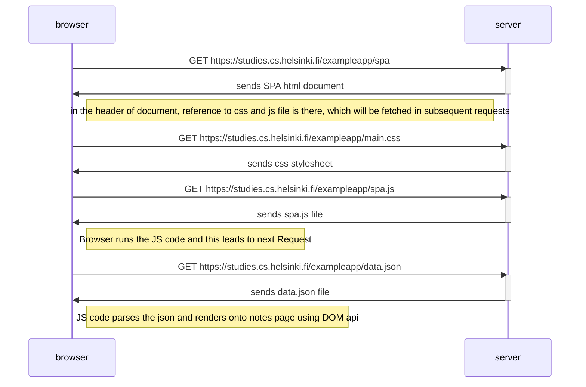

# Sequence Diagram, when user visits the SPA (https://studies.cs.helsinki.fi/exampleapp/spa)

```mermaid
sequenceDiagram
participant browser
participant server

browser->>server: GET https://studies.cs.helsinki.fi/exampleapp/spa
activate server
server->>browser: sends SPA html document 
deactivate server

Note right of browser: in the header of document, reference to css and js file is there, which will be fetched in subsequent requests
browser->>server: GET https://studies.cs.helsinki.fi/exampleapp/main.css
activate server
server->>browser: sends css stylesheet
deactivate server

browser->>server: GET https://studies.cs.helsinki.fi/exampleapp/spa.js
activate server
server->>browser: sends spa.js file
deactivate server

Note right of browser: Browser runs the JS code and this leads to next Request
browser->>server: GET https://studies.cs.helsinki.fi/exampleapp/data.json
activate server
server->>browser: sends data.json file
deactivate server
Note right of browser: JS code parses the json and renders onto notes page using DOM api
```